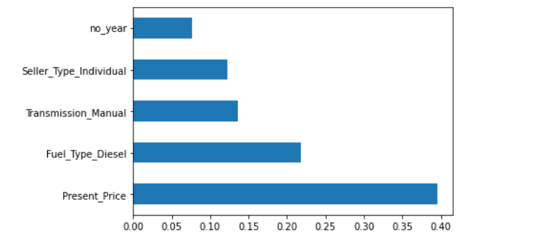

<h3> 1. To predict the price of a car based on its past and present data, I built a model using RandomForestRegressor and a RandomizedSearchCV which gave a Mean Absoulte Error of only 60%. <h3>
<h3> After performing data preprocessing steps such as Removal of Outliers, Converting categorical data into numerical using get_dummies and data visualizations, I found that Current Price, Fuel Type(being Diesel) and Transmission control are the most important features in deciding the price as shown in the fugure below.<h3>  
 
  
 

